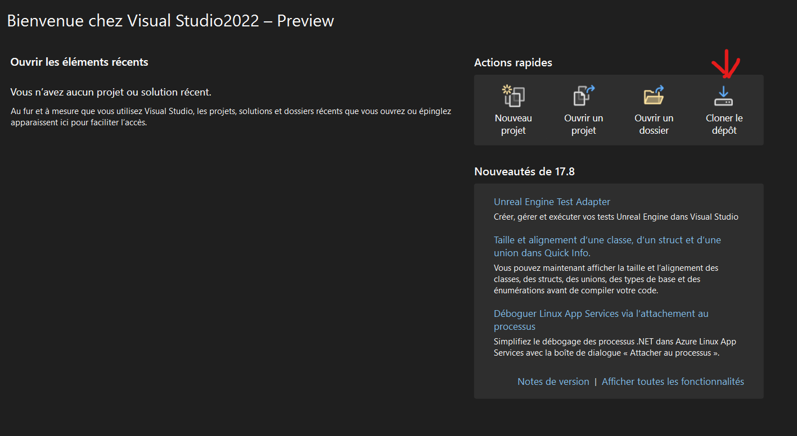

# Setting Up GitHub and Visual Studio Environment

The first step to our group work is to create an environement for everyone to work with.

## Environment Configuration

### GitHub Repository Setup

1. **Creating a New Repository**

   
   
   - To begin my journey, I created a repository on the github website

   

   - There are many things I can change here: the repository name, description in the README, and visibility settings.
   This the first step to start my portfolio and the teamwork as it is a place where we can share code and files easily.

2. **Repository URL**

   
   
   - Here we can copy the link to the repository so that we'll be able to copy it on github desktop.
   - The website also lets you directly open github desktop. If it isn't installed, the website will let you do that.
   From now on, we will mainly work on github desktop as it is way more conveniant. It allows you to have a copy of the files directly on your computer and let's you update it online from there.

3. **Cloning Repository in Git Desktop**

   
   
   - Using the button on the website should've openned this pop up.
   - You can also access it using File->Copy Repository
   - you can now paste the repository link in the box made for it and press copy.
   with this, you have the same files that are online and can change them in real time.

### GitHub Repository Setup

4. **Pull the changes in Git Desktop**

   
   -Using the fetch button, we can check if anyone did some change to the repo.
   -Using pull, we can receive these changes directly on our repo.
   Github lets everyone how is allowed modify the files, which is very convenient while working in a group.

5. **Push the changes in Git Desktop**

   
   -Use commit to main to transform the repo with your changes.
   -Fetch origin will change to push. Using the push button, we can send to everyone what we have modified in our repo.
   This fonction goes by pair with the fetch and pull, allowing a smooth flow of files and changes in a group work.

### Visual Studio Configuration

6. **Visual Studio Installation**

   
   
   Visual Studio is highly customisable and is recomended for this group work. This IDE is able to work with a lot of programing languages and is suitable for C#.

7. **Copy repository**

   
   
   Copying the repository in VS ables instant access to the files you're working on.

## Reflection

### Configuration Decisions

Setting up this development environment lets us easily share files and code. E-mailing every change to everyone everytime does something seems impossible and terribly messy. Using VS as our IDE lets us work in multiple languages and lets us directly communicate with VS.

### Limitations and Resolutions

I had issues linking VS to the green team repository, That is why I used Github Desktop for now.

### Alternative Configurations

I think Github Desktop is a fairly valid option combined with  another IDE, depending on the coding language used.