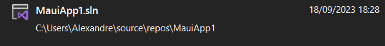
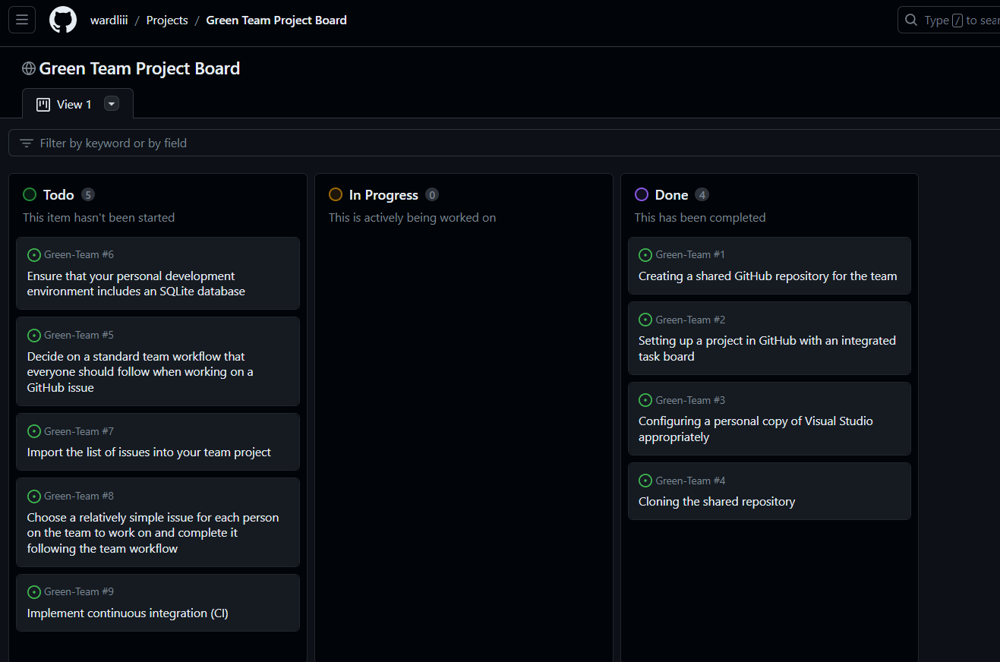
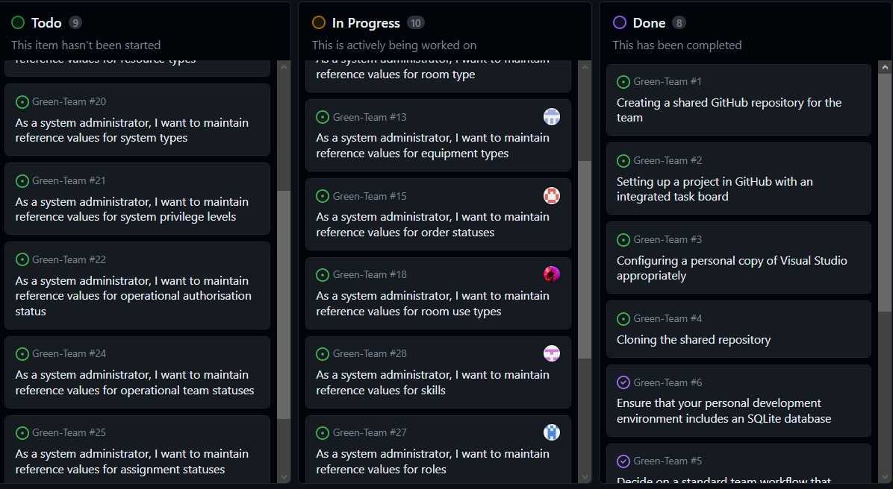
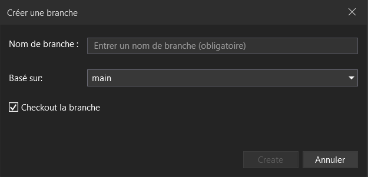
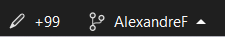
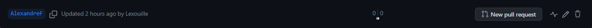

# Week 3 Practical Work Documentation

In this document, I will provide a detailed overview of my practical work for week 3. The primary focus is on demonstrating my proficiency in using GitHub workflow tools and successfully completing the required operations.

## GitHub Workflow Tools

### Accepting a Task from the Project Backlog

1. **Getting started with .NET MAUI:**

   

   - I created a MAUI test Project following the microsoft tutorial, installing an Android emulator.

### Accepting a Task from the Project Backlog

2. **Task Acceptance:**

   
   

   - We created many issues and people would be able to comment on them for the owner of the repo to assign us on it.

### Using branches

3. **Feature Branch Work:**

   
   

   - I created and worked on a feature branch to complete the assigned development task.
   - This branch isolates the task, facilitating focused development.

### Making a Pull Request

4. **Pull Request Creation:**

   

   - As I am making this file, I didn't finish the task I was assigned. I could created a pull request to propose the merging of my feature branch into the main branch.

## Task Workflow

For our workflow, we will use the GitHub Flow: https://docs.github.com/en/get-started/quickstart/github-flow

## Reflection

### Difficulties and Resolutions

During this week's practical work as a team we faced issues regarding the app. This led to us not being able to solve our tasks on time and led to big loss of time. I also have issues understanding what a DoD is.

