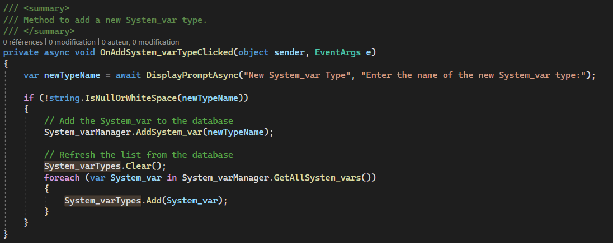
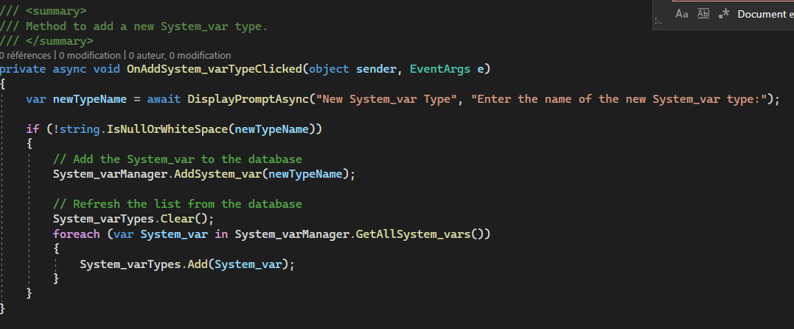
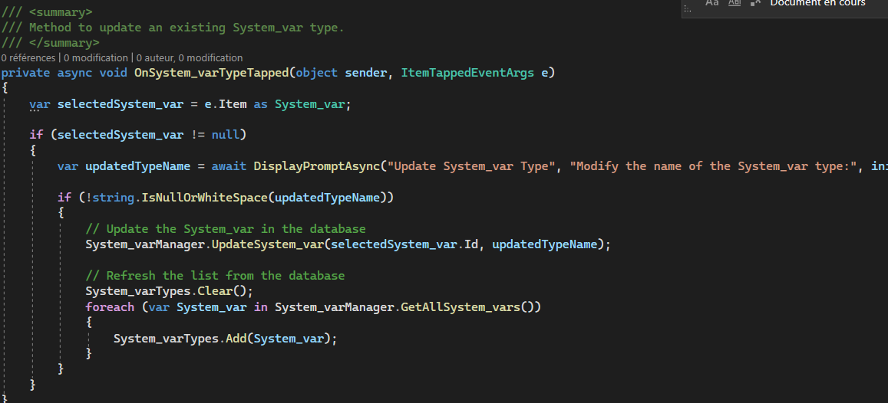
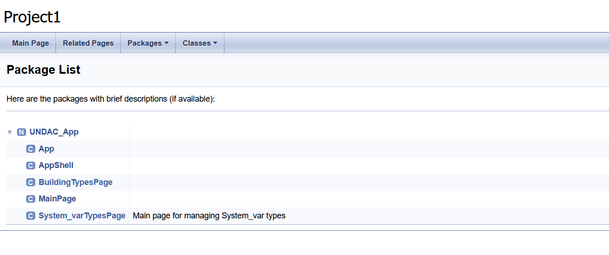

# Documentation

This section is related to your work on clean code and documentation in week 5. I originaly failed to make my part of the app that was due for week 3,, but I am now commenting it as I finished it during this week's practical.

## Clean Code Rules

### Rule 1: Meaningful Variable Names

**Summary**: In clean code, variable names should be descriptive and indicative of their purpose, promoting code readability.
- 
**Example**: In the code provided, the variable `System_varTypes` represents a collection of system variables, making its purpose clear.

**Implementation**: The choice of variable name `System_varTypes` effectively communicates its role in the code.

### Rule 2: Avoid Magic Numbers

**Summary**: Avoid using hard-coded, unexplained numerical values (magic numbers) in the code. Instead, use named constants or variables with descriptive names.

**Example**: In the code, there are no instances of magic numbers. All numbers and values are self-explanatory or stored in variables/constants.

**Implementation**: The absence of magic numbers enhances code readability and maintainability.

### Rule 3: DRY Principle (Don't Repeat Yourself)

**Summary**: Avoid duplicating code segments. Reuse code whenever possible to reduce redundancy and simplify maintenance.

**Example**: In the code provided, the same validation logic for user inputs is repeated in multiple event handlers.

**Implementation**: To adhere to the DRY principle, the validation logic can be encapsulated in a separate method and called from each event handler, reducing code duplication and improving maintainability.

### Rule 4: Proper Indentation and Formatting

**Summary**: Maintain consistent and clear code formatting with proper indentation, line breaks, and spacing.
- 
**Example**: The code is well-formatted with consistent indentation and spacing, enhancing readability.

**Implementation**: Consistent formatting improves code readability and maintainability.

### Rule 5: Single Responsibility Principle (SRP)

**Summary**: Each function or class should have one clear responsibility. Avoid functions or classes that do too many things.
- 
- 
**Example**: In the code, each method ( `OnAddSystem_varTypeClicked`, `OnSystem_varTypeTapped`, for exemple here) has a clear and distinct responsibility related to system variable management.

**Implementation**: The code adheres to the SRP by assigning specific tasks to individual methods.

### Rule 6: Clear and Concise Comments

**Summary**: Use comments sparingly and focus on explaining the 'why' and not the 'how.' Clear, concise comments provide valuable insights into code intent.

**Example**: The code provides comments explaining the purpose of each method and event handler, making it clear why each piece of code exists.

**Implementation**: Comments in the code provide insights into code intent and are concise, aiding understanding without duplicating code explanations.

## Integration of Doxygen Comments

Doxygen comments have been integrated into the codebase to facilitate code documentation. However, Doxygen failed to provide any changes to the code comments, issueing in not adding anything. I think a bug occured and doing it multiple times did not change the result of the maneuver.

- 
- 

## Highlighting Clean Code Practices

Three examples will be provided to showcase how clean code practices have eliminated the need for comments:

1. **Descriptive Function Names**: Function names like `OnAddSystem_varTypeClicked` and `OnSystem_varTypeTapped` clearly indicate their purpose, eliminating the need for additional comments.

2. **Proper Indentation and Formatting**: The code is indented accordingly to the C# coding practices. As it is not necessary for the code to run unlike python for exemple, it is helpful to make the code self explainatory and remove the need for comments.

3. **Avoidance of Magic Numbers**: No magic numbers are present in the code; variables and constants are used instead, making the code self-documenting.

## Conclusion

This documentation highlights the adherence to clean code principles, the integration of Doxygen comments which unfortunatly didn't work out, and the reduction of comments through clean code practices. The provided examples and explanations aim to enhance code quality and maintainability, thus offering a better experience for futur people working on the code.
