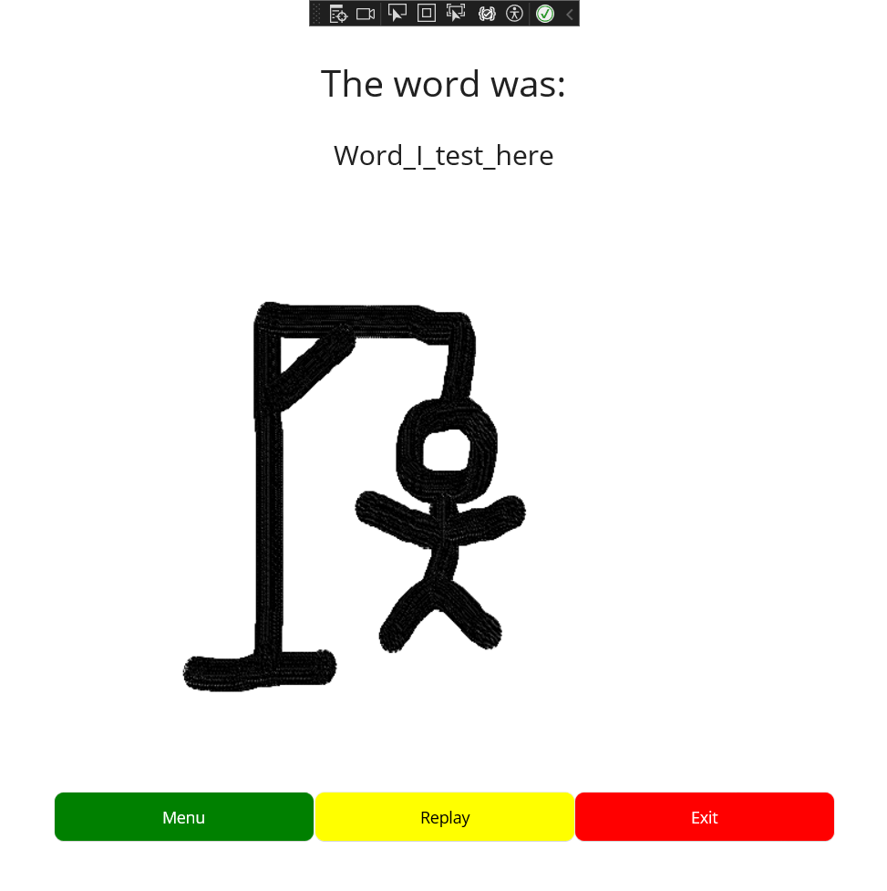
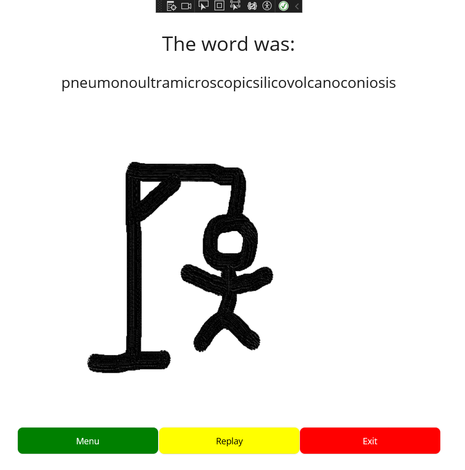
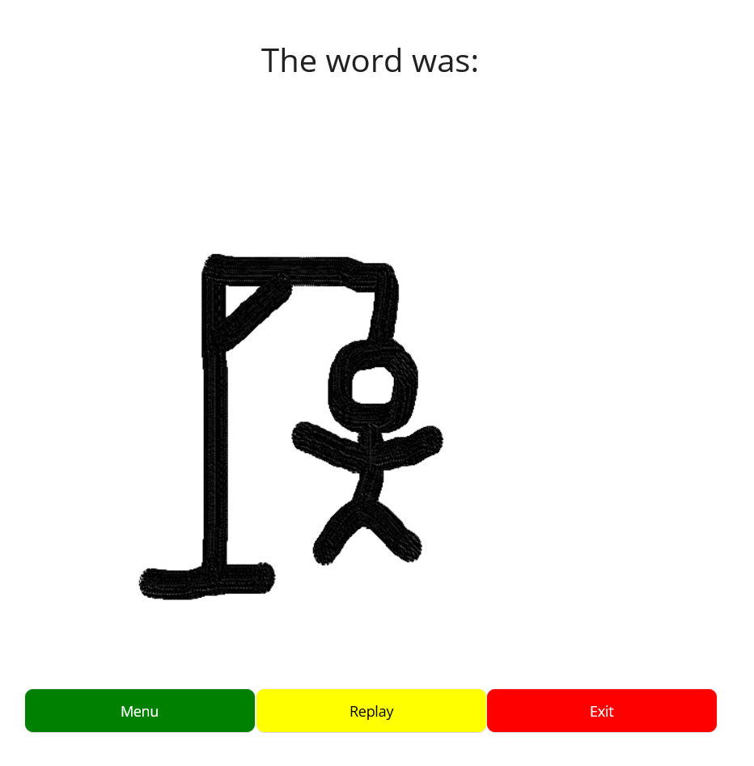

# Testing

We had a lot of issues during the practical, putting in place the code tester. In fact, we tried to fix the issues for the whole class. After we went home I've set myself the goal to create the GameOver() function which creates a menu at the end of the game, showing the word the player was trying to find, and letting him return to the menu, play again with the same difficulty and exit the app.

## Code exemples and testing

As you know, we had to change to xunit to test the code, which I had also issues with. I decided that it was better to test the hard way than just blaming an issue and not do any testing. It led to multiple tests being presented to me:
- Testing different words of different lenghts to be printed on screen.
- Testing multiples difficulties to replay in.
- Simply checking that the GameOver() launches well.

For the later, I simply changed the OnAttemptSubmitted() for it to launche GameOver() instantly:

``` csharp
private void OnAttemptSubmitted(object sender, EventArgs e)
{
    GameOver(Word, GameType);
}
```

We can notice that GameOver() now has 2 parameters, being the word and the gametype, both strings.
For the GameOver() to create a new page, I have to create a new .xaml.cs and .xaml file and have the game over lead to that page.

``` csharp
private void GameOver(string word, string gameType)
{
    Console.WriteLine("Go to GameOverPage");
    Navigation.PushAsync(new GameOverPage(word,gameType));
}
```

While working on this page I learnt a lot about how a MAUI .NET app work. And by looking at the already existing code and by trial and error, I've mannaged to create a page that recieves the information of other pages. 

``` csharp
public partial class GameOverPage : ContentPage
{
    public string Word { get; set; }
    public string GameType { get; set; }
    public GameOverPage(string word, string gameType)
    {
        InitializeComponent();
        Word = word;
        GameType = gameType;
        BindingContext = this;
    }
// - - -
}   
```

For exemple here I set my variables to the strings I recieve and with the line BindingContext, I make it so tat in the .xaml I am able to show the information on screen using Binding:

``` xaml
<Label
Text = "{Binding Word}" 
    FontSize="24"
    HorizontalOptions="Center"
/>
```

With the first I did, being that the page shows on screen when required, I decided to try deferent lenghts of words:

``` csharp
private string SelectWord(string gameType)
{
	return "Word_I_test_here";
}
```

- 

I thought of every possibility and what would happen in the future if, for exemple, the game would use every word of the english language. So I tried with the longest english word.

- 

And if for any reason the word happened to be set to null, the program would behave as intended:

- 

# Conclusion

I am quite puzzeled by this testing class and it appears to be the same for my team, we had a lot of issues this whole week. I will use a part of my classless week to figure it all out as I am in the incapacity of finding a solution for now.
